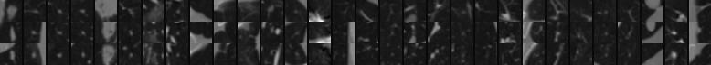

# Automated Diagnosis of Lung Cancer with 3D Convolutional Neural Networks

Pytorch implementation for [Automated lung cancer diagnosis using three-dimensional convolutional neural networks](https://rdcu.be/b4Gc7). 
Our cancer predictor obtained a ROC AUC of 0.913 and was ranked 1st place at the [ISBI 2018 Lung Nodule Malignancy Prediction challenge](https://bit.ly/2JPNnGS).

## Table of contents
* [Getting started](#getting-started)
* [Datasets](#datasets)
* [Lung cancer diagnosis](#lung-cancer-diagnosis)

## Getting started

In this section we show how to setup the repository, install virtual environments (Virtualenv or Anaconda), and install requirements.

<details>
<summary>Click to expand</summary>

1. **Clone the repository:** To download this repository run:
```
$ git clone https://github.com/gperezs/LungCancerDiagnosis-pytorch.git
$ cd LungCancerDiagnosis-pytorch
```

-------
### Using Anaconda

2. **Install Anaconda:** We recommend using the free [Anaconda Python
distribution](https://www.anaconda.com/download/), which provides an
easy way for you to handle package dependencies. Please be sure to
download the Python 3 version.

3. **Anaconda virtual environment:** To set up and activate the virtual environment,
run:
```
$ conda create -n <env name> python=3.*
$ conda activate <env name>
```

To install requirements, run:
```
$ conda install --yes --file requirements.txt
```

4. **PyTorch:** To install pytorch follow the instructions [here](https://pytorch.org/).
</details>

## Trained models

Trained models are included with this repository at in `models/`. Detector model was trained with the [LIDC-IDRI dataset](https://wiki.cancerimagingarchive.net/display/Public/LIDC-IDRI) and the predictor with the [Kaggle DSB2017 dataset](https://www.kaggle.com/c/data-science-bowl-2017).

## Lung cancer diagnosis

To run the code save the folder of each patient with the dicom files in the folder `data/ISBI-deid-TRAIN/`. We already include a subject (LIDC-IDRI-003) in this repository. To see a demo with this subject:
```
bash run_diagnose
```
If a the program is ran in the CPU it might take several minutes to complete. When a CUDA device is available, run:
```
bash run_diagnose --GPU=<gpu id>
```
The program will print a single lung cancer probability per subject. Also, the program will save images of 
the axial, sagittal and coronal planes of the 30 detected nodules with highest score of each patient in 
folder `output/sorted_slices_jpgs/` (As the example shown below). 

<h1 align="center">
  <a></a>
</h1>

### Run with ISBI 2018 lung challenge subjects

To run the code save the folder of each patient with the dicom files (of the ISBI 2018 Lung challenge) in the folder `data/ISBI-deid-TRAIN/`. Then, run:
```
bash run_diagnose.sh --IS_ISBI=1
```

If the dataset from the [ISBI 2018 Lung Nodule Malignancy Prediction challenge](https://bit.ly/2JPNnGS) is used, the AUC will be printed using the challenge released labels (including the mask post-processing). 


## Citing this work

If you find this work useful in your research, please consider citing:
```
@article{PA_MBEC2020,
    author = "{G. Perez and P. Arbelaez}",
    title = "{Automated lung cancer diagnosis using three-dimensional convolutional neural networks}",
    journal = "{Medical & Biological Engineering & Computing}",
    year = {2020},
    Month = {jun},
    doi = {10.1007/s11517-020-02197-7},
}
```
